# Lab 01 — Identity and Access Management (IAM)

**Who can do what in an AWS account, and how to prove it.**

In a small business, most security incidents start with an access problem: a shared password, an account that can do too much, a forgotten resource left open. This lab builds the access controls I will apply to my own company, King West, then audits my own account and fixes what I found.

All work was done on my personal AWS account, at zero cost.

---

## 1. A role that requires MFA

I created a role that can only read files (Amazon S3 read-only). Nobody can use it without a second factor (MFA).

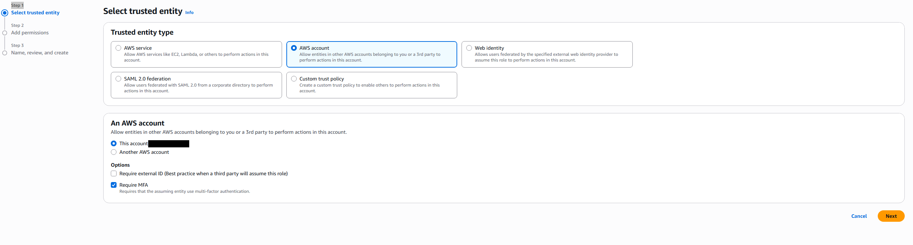
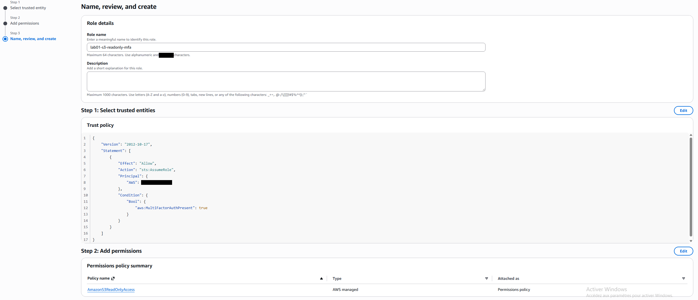

Even with this role, any attempt to touch user management is refused.

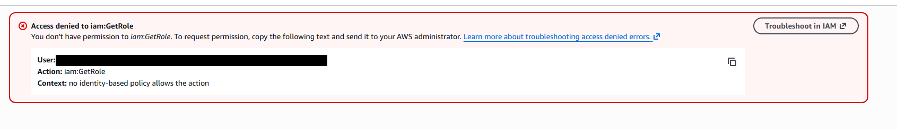

**What it proves:** a stolen password alone is not enough, and a read-only role really is read-only.

---

## 2. Access limited to one bucket and one network

I wrote a policy by hand (JSON) that allows reading **one** storage bucket, and only from **my office IP address**.

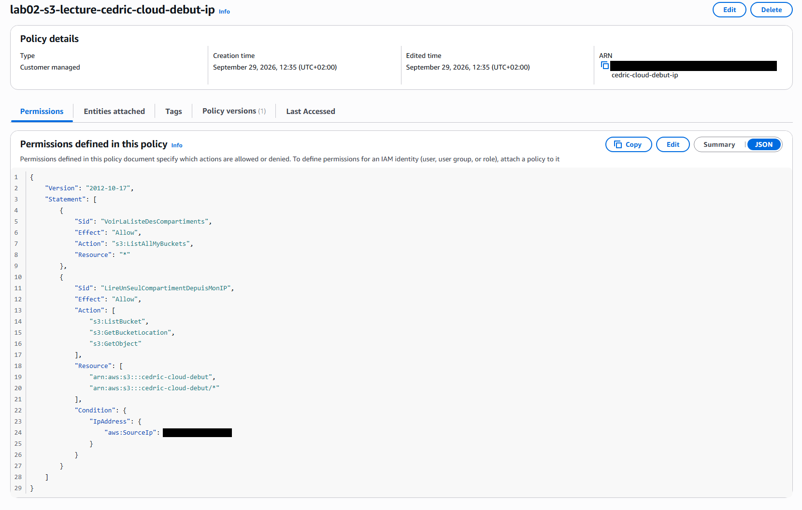

When I changed the allowed IP to a fake one, access was cut immediately.

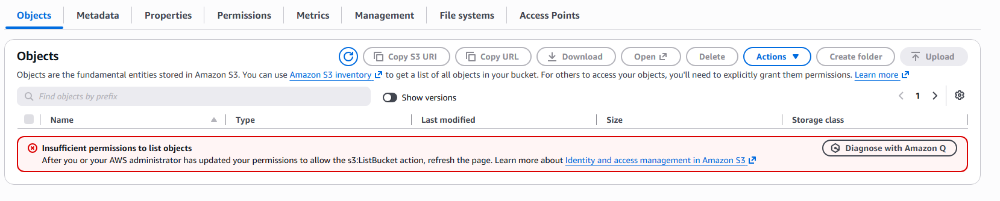

Every change to a policy is versioned, so a mistake can be rolled back.

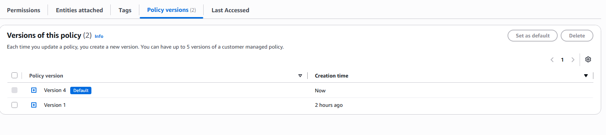

**What it proves:** I can grant the minimum access needed, restrict it to a location, and undo a bad change.

---

## 3. A ceiling no one can break: the permissions boundary

I set a **permissions boundary** on the role: a maximum it can never exceed. Then, on purpose, I gave the role full S3 access.

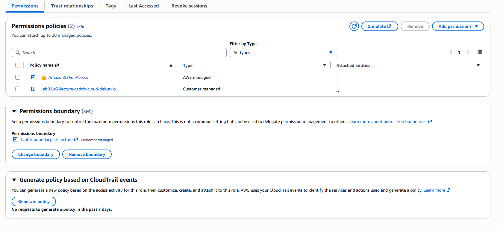

Creating a bucket was still refused, because the boundary does not allow it.

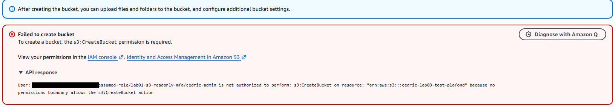

**What it proves:** when a task is delegated to someone else, a ceiling stops them from granting themselves more rights.

---

## 4. Employee access through a single portal (IAM Identity Center)

I set up IAM Identity Center: one login portal, users in groups, MFA required. A test employee in the group `lecteurs-s3` gets a read-only permission set.

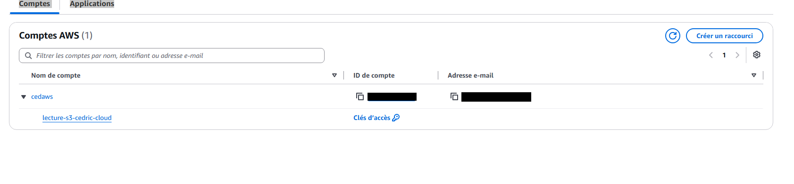

Logged in as that employee, I can read, and everything else is refused.

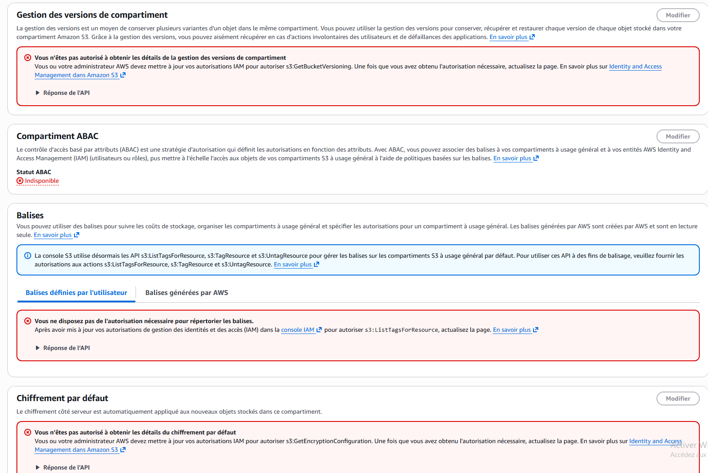

**What it proves:** employees get their own login and only the access their job needs. No shared accounts and no long-term passwords on AWS.

---

## 5. Audit of my own account: 4 findings, 4 fixes

I then audited my own account as I would audit a client's.

| # | Finding | Risk | Fix |
|---|---|---|---|
| 1 | 4 orphaned roles, including one with full S3 read access | Forgotten access nobody watches | Deleted |
| 2 | Budget alert at over 300 % every month, because of a subscription and tax | An alert that always rings gets ignored | Filtered on real usage: now 7 % ($0.70) |
| 3 | A storage bucket left **public** from an old website test | Anyone on the internet could read its files | Public policy removed, Block Public Access on |
| 4 | A stopped server left since July | Its disk was billed silently | Terminated, disks and IP checked empty |

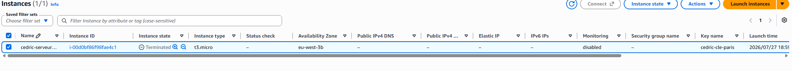
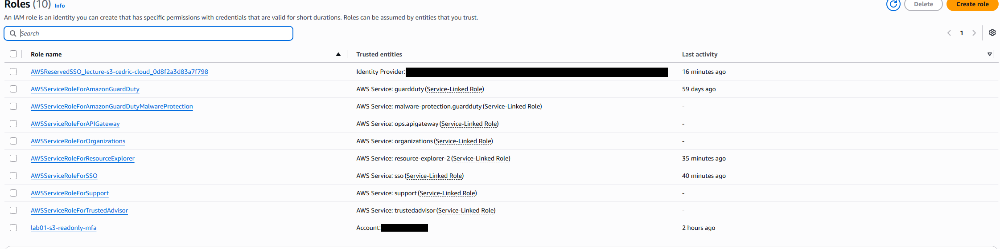
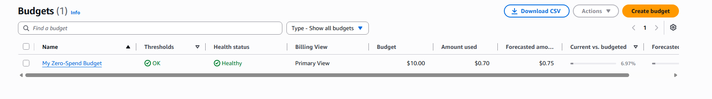
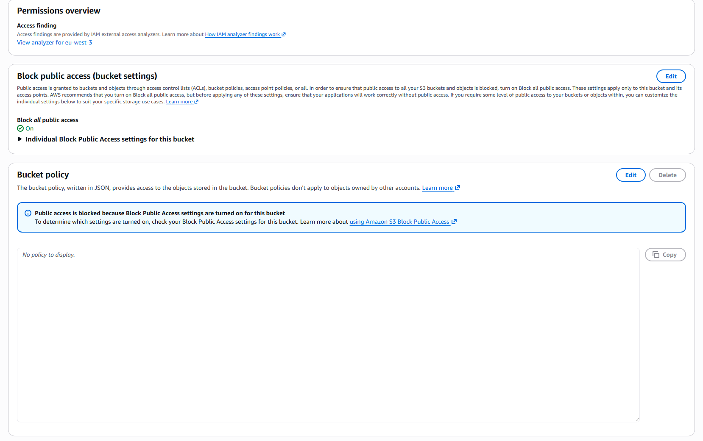

The policy that made the bucket public (finding 3) was:

```json
{
  "Effect": "Allow",
  "Principal": "*",
  "Action": "s3:GetObject",
  "Resource": "arn:aws:s3:::cedric-cloud-debut/*"
}
```

`"Principal": "*"` means **everyone**. This is the most common data leak on AWS, and I made it myself on a test I forgot to clean up. That is exactly why audits exist.

---

## Known limitation

These labs were run in the organization's **management account**. Best practice is to keep that account empty and work in member accounts. Lab 02 (AWS Organizations) moves the tests to a member account.

---

## What a business owner should take from this

- Every access is named, limited and protected by MFA.
- Mistakes happen, including mine. A regular audit finds them before someone else does.
- Each control above takes minutes to set up and costs nothing.

*Account numbers, IP addresses and e-mails are masked in all screenshots.*
